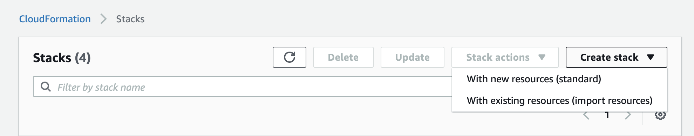
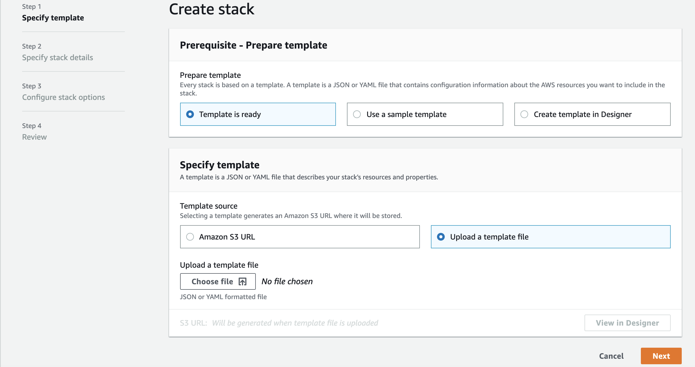
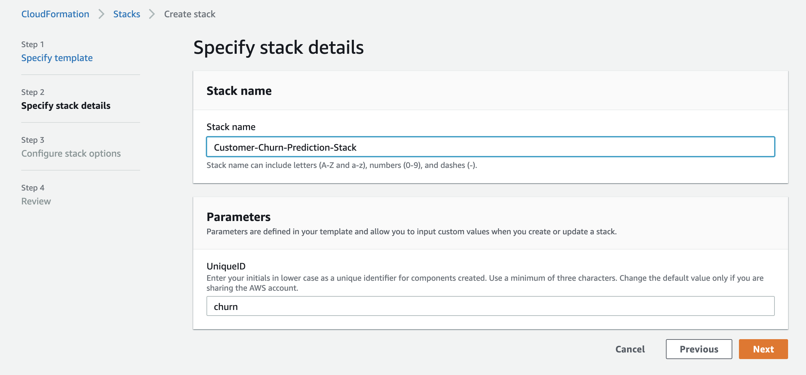
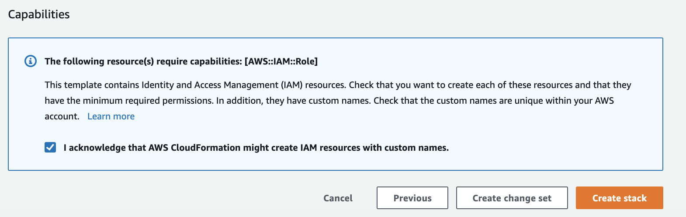
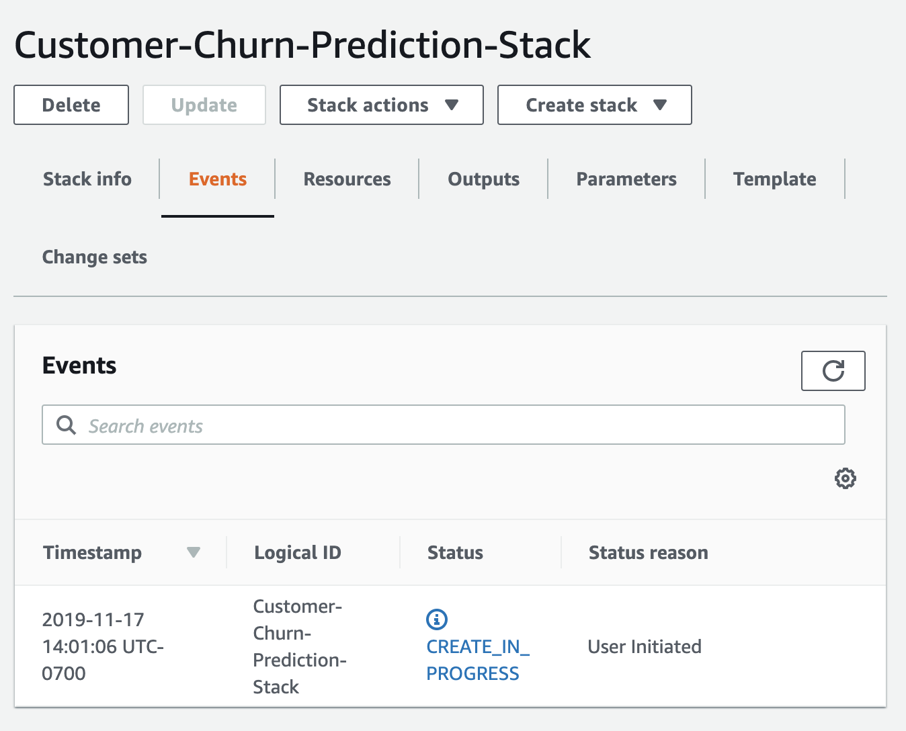
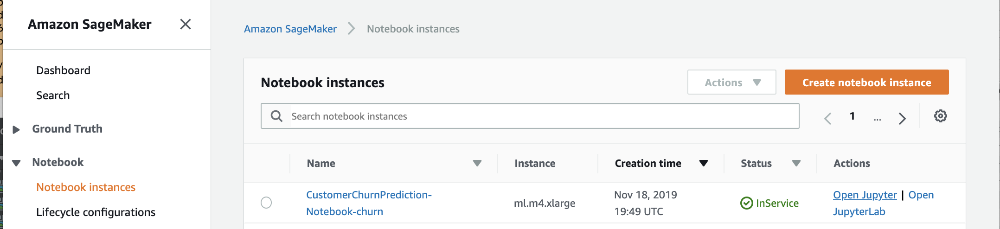
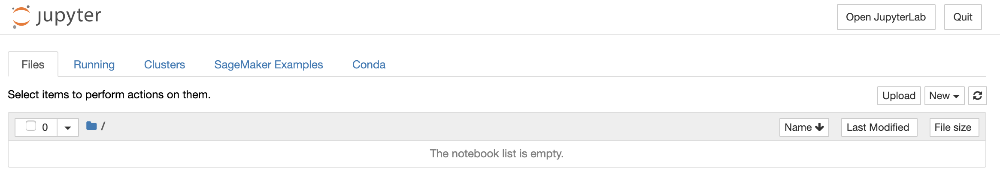

# customer-churn-prediction-amazon-sagemaker-workshop
Workshop to build, train and deploy XGBoost model for customer churn prediction on Amazon SageMaker

Losing customers is costly for any business. Proactively identifying customers that are likely to leave early on gives 
the business a chance to offer customers appropriate incentives to stay. This is the problem of customer churn prediction.

In this lab, we will use XGBoost, a well understood machine learning supervised learning algorithm
for customer churn prediction.  In particular, we will use Amazon SageMaker's built-in XGBoost algorithm.  We will also use Amazon SageMaker managed service to build, train and deploy the XGBoost customer churn prediction model.

Let’s get started. 

### Prerequisites

To run this workshop, you will need 
* An AWS Account 
* IAM user with access to the AWS services : S3, SageMaker, CloudFormation 

### High Level Steps

High level steps to run the workshop :

1. Setup : Execute a cloudformation template that creates a Amazon SageMaker notebook.
2. Build, train and deploy XGBoost model : Open the Jupyter notebook created in step 1 and execute the example notebook provided in SageMaker Examples --> Introduction to Applying Machine Learning --> xgboost_customer_churn.ipynb.
 
#### Step 1 - Setup

In this step, you will execute a Cloud Formation template to setup workshop environment by creating:

* SageMaker Notebook Instance: This notebook instance will be used as our lab environment.
* IAM Role : Role attached to the notebook instance that allows access to an S3 bucket to save training data and trained models.

##### Detailed Steps

1.1. Download this git repository by either cloning the repository or downloading the zip

1.2. Login to the [AWS Console](https://console.aws.amazon.com/) and enter your credentials

1.3. Under **Services**, select search for and select [CloudFormation](https://console.aws.amazon.com/cloudformation)

1.4. Click **Create Stack** button and select "With new resources (standard)" option

   
   
1.5. Under **Select Template**
    
   Click radio button next to 'Upload a template to Amazon S3', then click **Browse**
    
   From the local repository cloned to your machine in the detailed step 1, select the file ./prep/Workshop-Prep.yml
    
   Click **Open**
    
    
1.6. Under **Specify Stack Details**, enter: 

   *  **Stack name**: Customer-Churn-Prediction-Stack

   *  **UniqueID**: Enter *yourinitials* in lower case (Example: jdd)
   (Note : Change the default value only if you are sharing the AWS account with other participants)

   

1.7. Click **Next**

1.8. Under **Options**, leave all defaults and click '**Next**'

1.9. Under **Review**, scroll to the bottom and check the checkbox acknowledging that CloudFormation might create IAM resources and custom names, then click **Create**

1.10. You will be returned to the CloudFormation console and will see your stack status '**CREATE_IN_PROGRESS**'

1.11. After a few minutes, you will see your stack Status change to '**CREATE_COMPLETE**'.  You're encouraged to go explore the resources created as part of this initial setup. 

1.12. In the S3 console, make sure that the S3 bucket is created and make note of the bucket name.

#### Step 2 - Build, train and deploy XGBoost customer churn prediction model
In this step, you will open the SageMaker notebook instance created in Step 1.  
  
##### Detailed Steps
 
2.1. Under **Services**, select search for and select [Amazon SageMaker](https://console.aws.amazon.com/sagemaker)
 

2.2. Click "Open Jupyter"

2.3. This shows the contents of the notebook instance. 
 

2.4. Click on "notebook/xgboost_customer_churn.ipynb" to open the notebook.  

2.5. In the first code cell, specify the bucket name created in Step 1.  (bucket = '<<Specify bucket name>>')
2.5. For rest of the workshop, follow instructions in the notebook and execute each cell of the notebook.  

